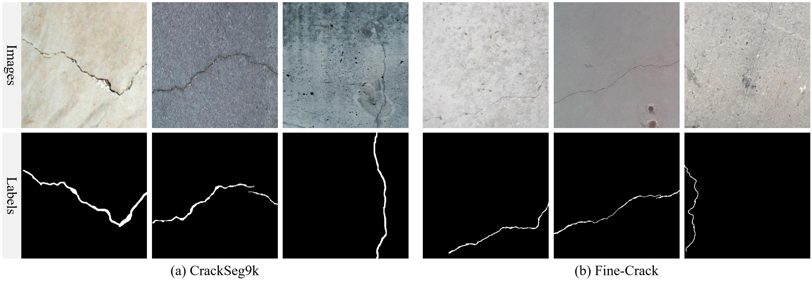
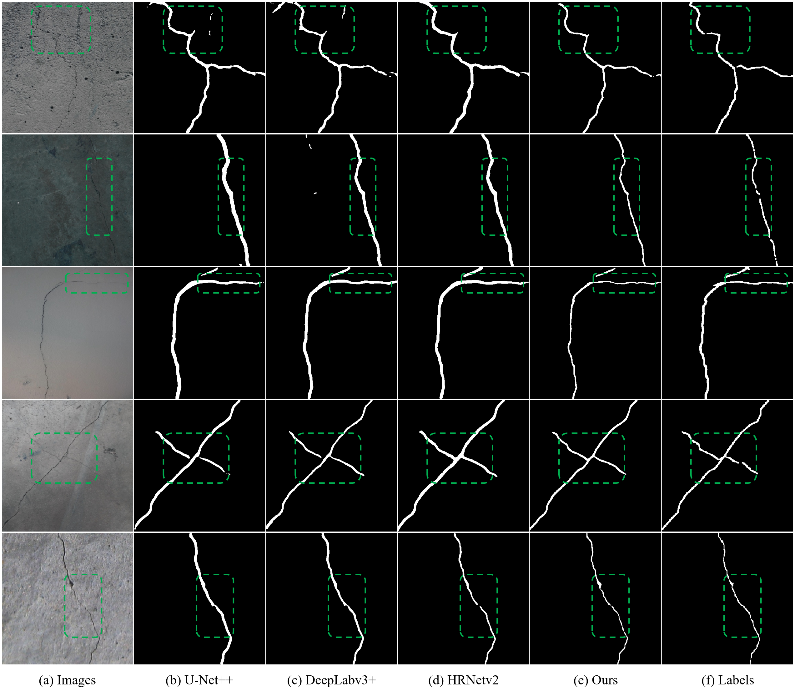
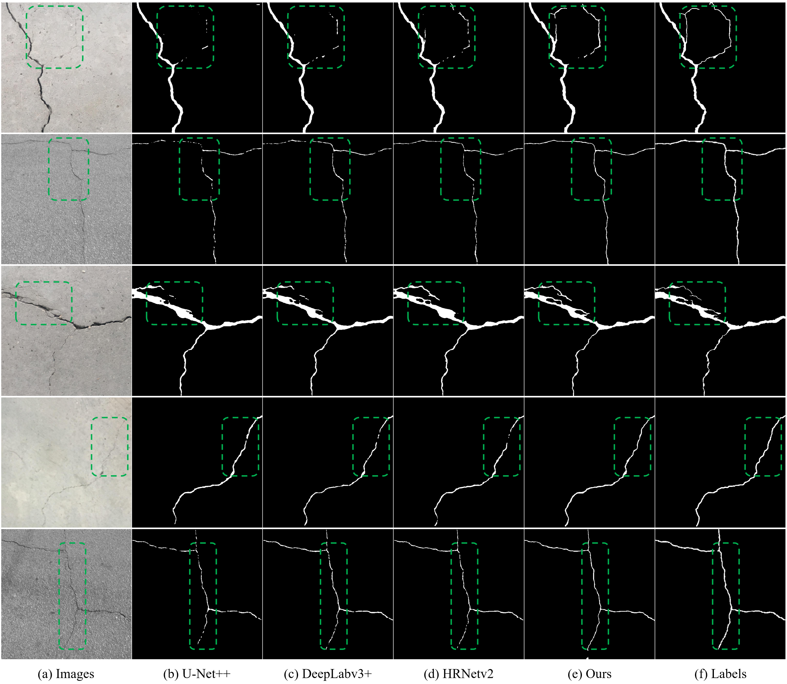

# CrackSeg
## Title: A Global-Local Contrastive Learning Framework with Multi-Structure Constraints for Reliable Tunnel Lining Crack Segmentation
## Abstract
Tunnel lining cracks are among the most common structural defects in operational tunnels, and accurate and reliable automatic detection is a fundamental prerequisite for intelligent tunnel maintenance. However, due to the extremely fine scale of lining cracks, weak structural cues, and complex background interference, existing approaches still face limitations in segmentation accuracy and structural continuity. To address these challenges, this study proposes a global-local contrastive learning framework with multi-structure constraints for reliable tunnel lining crack segmentation. First, a multi-scale structural-semantic feature enhancement strategy is developed, where multiple structural operators are employed to extract fine-grained geometric priors, and spatial-channel attention mechanisms are introduced to achieve adaptive fusion of structural and semantic features, thereby strengthening local representation of micro-cracks. Second, considering the multi-level structural characteristics of crack regions and centerlines, a multi-task supervised optimization scheme with spatial position constraints is designed to jointly learn regional and skeletal information, improving structural completeness and geometric consistency. Furthermore, a semi-supervised contrastive learning mechanism based on crack object-level global feature consistency is introduced to enhance robustness and generalization under complex environments. Extensive experiments conducted on the public available large-scale CrackSeg9k and private collected Fine-Crack datasets demonstrate that the proposed method outperforms several recent state-of-the-art crack segmentation approaches, achieved 77.69% and 78.20% in terms of F1-score, respectively, showing superior continuity and boundary accuracy, particularly for fine-scale crack detection.

## Datasets
To evaluate the proposed method, experiments were conducted on the public [CrackSeg9k](https://dataverse.harvard.edu/dataset.xhtml?persistentId=doi:10.7910/DVN/EGIEBY) dataset and a newly constructed Fine-Crack dataset targeting fine-scale crack segmentation.

## Experimental Results
### Results on CrackSeg9k test dataset:

### Results on Fine-Crack test dataset:

