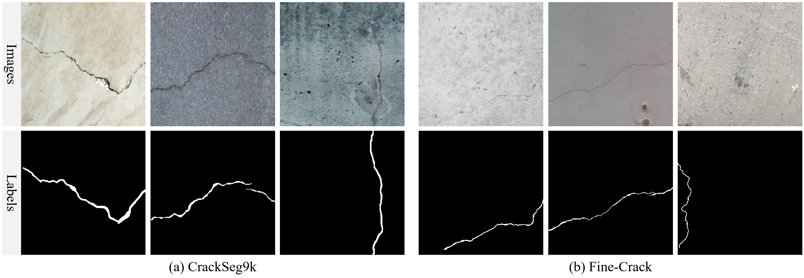
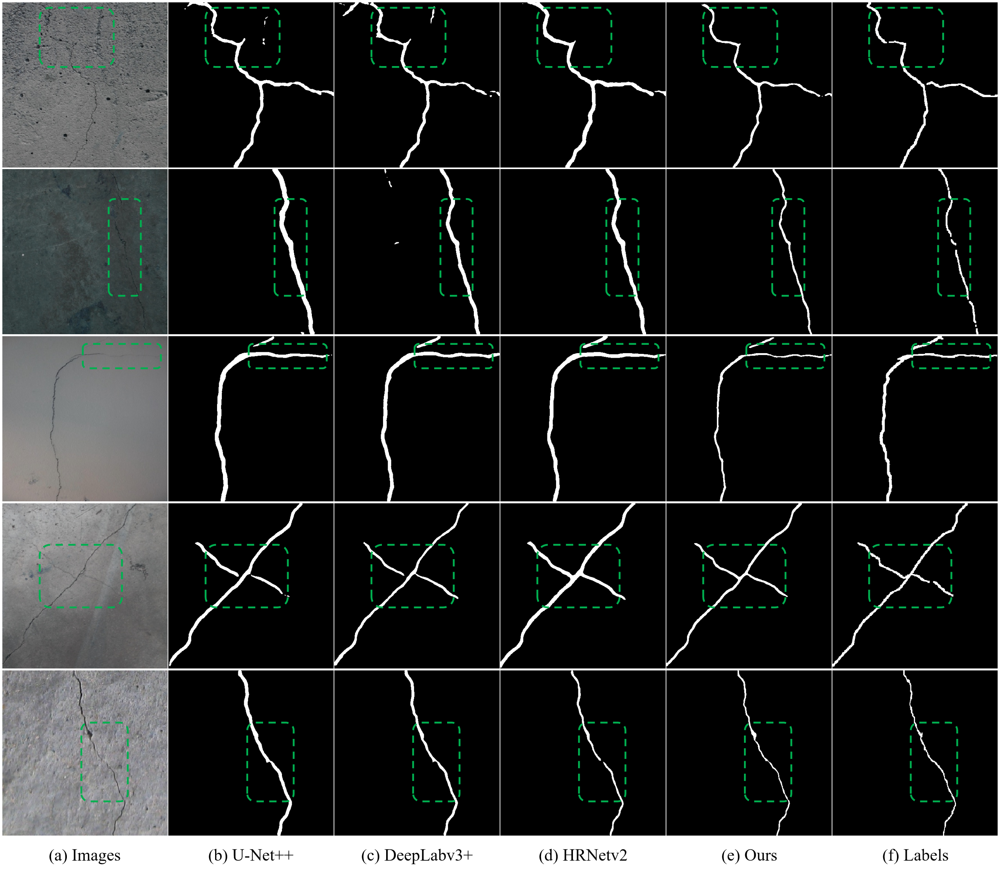
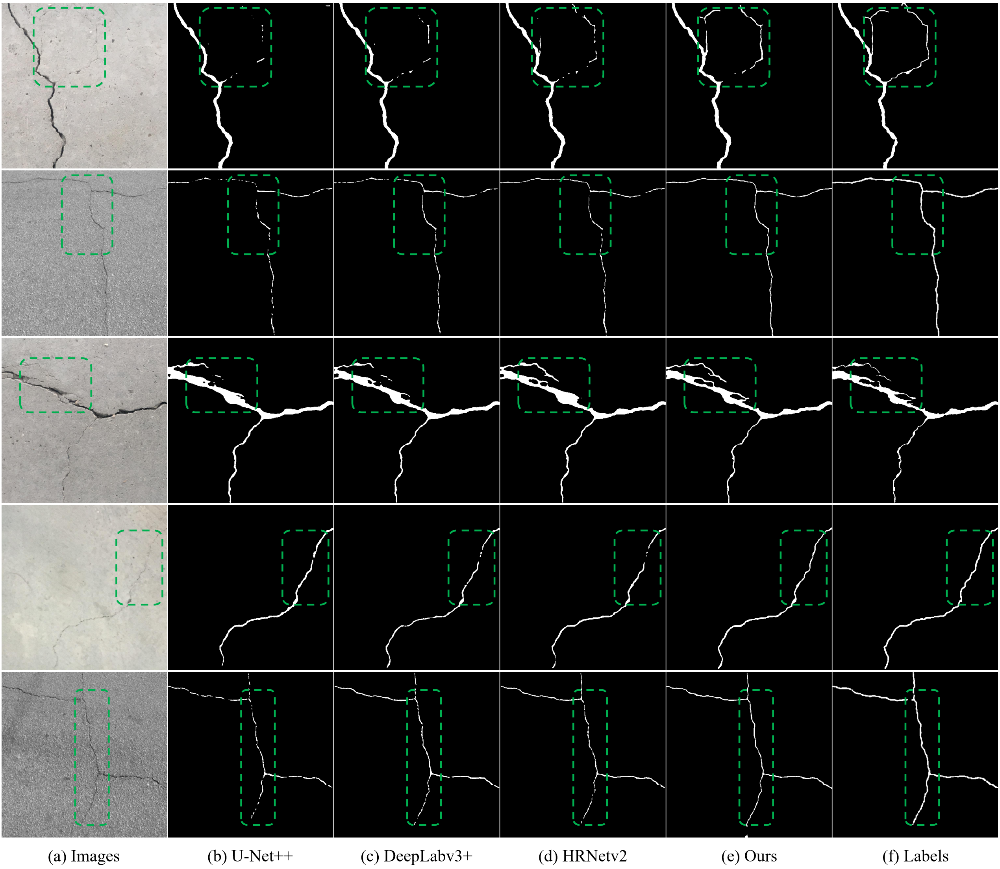

# CrackSeg
## Title: A Global-Local Contrastive Learning Framework with Multi-Structure Constraints for Reliable Tunnel Lining Crack Segmentation
## Abstract
Tunnel lining cracks are among the most common structural defects in operational tunnels, and accurate and reliable automatic detection is essential for intelligent tunnel inspection and maintenance. However, due to the extremely fine scale of lining cracks, weak structural cues, and complex background interference, existing approaches still face challenges in achieving high segmentation accuracy and maintaining structural continuity. To address these issues, this study proposes a global-local contrastive learning framework with multi-structure constraints for reliable tunnel lining crack segmentation. First, a multi-scale structural-semantic feature enhancement strategy is developed to strengthen the representation of fine-scale cracks. Multiple structural operators are introduced to extract fine-grained geometric priors, while a spatial-channel attention mechanism is employed to adaptively fuse structural and semantic features, thereby improving the local representation capability of micro-crack patterns. Second, considering the complementary structural characteristics of crack regions and centerlines, a multi-task supervised optimization scheme with spatial position constraints is designed to jointly learn regional and skeletal information, which enhances structural completeness and geometric consistency. Furthermore, a semi-supervised contrastive learning mechanism based on crack object-level global feature consistency is introduced to improve model robustness and generalization under complex tunnel inspection environments. Extensive experiments conducted on the publicly available CrackSeg9k and the self-collected Fine-Crack datasets demonstrate that the proposed method outperforms several recent state-of-the-art crack segmentation approaches. The proposed framework achieves F1-scores of 77.69% and 78.20%, respectively, showing superior structural continuity and boundary accuracy, particularly for fine-scale crack detection.
## Datasets
To evaluate the proposed method, experiments were conducted on the public [CrackSeg9k](https://dataverse.harvard.edu/dataset.xhtml?persistentId=doi:10.7910/DVN/EGIEBY) dataset and a newly constructed [Fine-Crack](https://pan.baidu.com/s/1UJ__0yXdcKAKgomYsf8ylA?pwd=gydv) dataset targeting fine-scale crack segmentation.

## Experimental Results
### Results on CrackSeg9k test dataset:

### Results on Fine-Crack test dataset:

